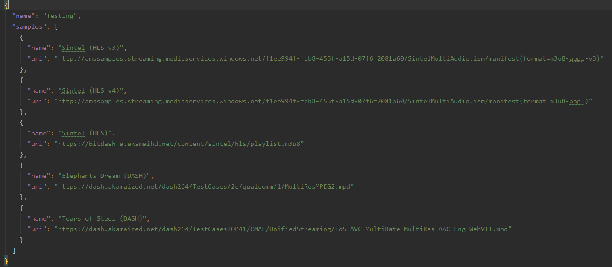
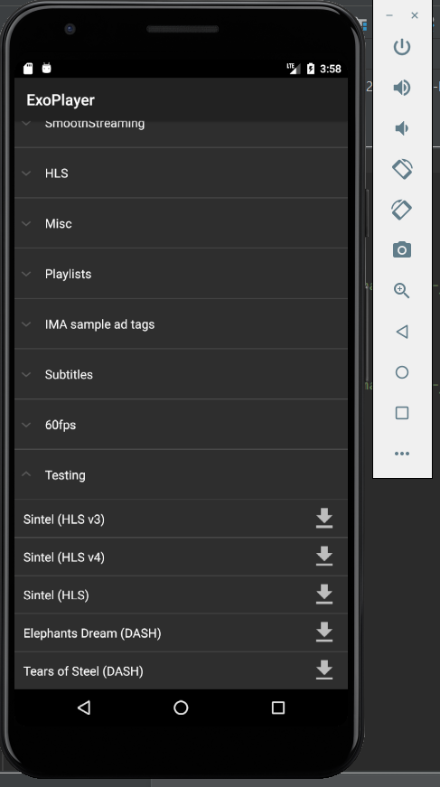

### Creating a virtual device emulator ###
* Select open AVD manager from the available devices drop down list. The drop down list is next to the configuration drop down list.
* When the AVD manager window displays follow the following steps for an example. 

  Created Virtual device... -> Phone -> Pixel 3a XL -> Next -> Marshmallow 23 (Download if needed) -> Next -> Portrait -> Finish
  
### Creating a playlist ###
* Edit the media.exolist.json file
* Located in demos/assets/media.exolist.json
* Can directly add your own content 
* For Example:

* Playlist should then be available
 
 